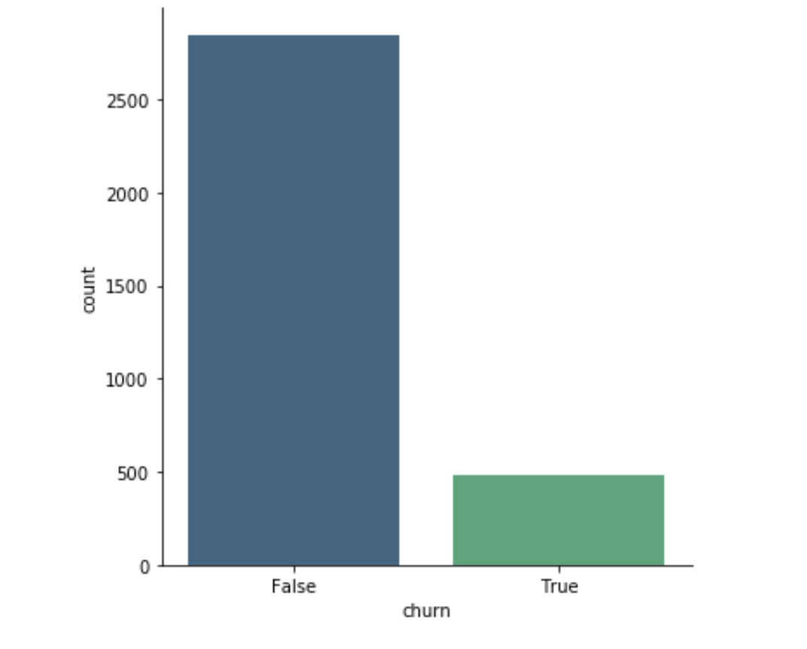
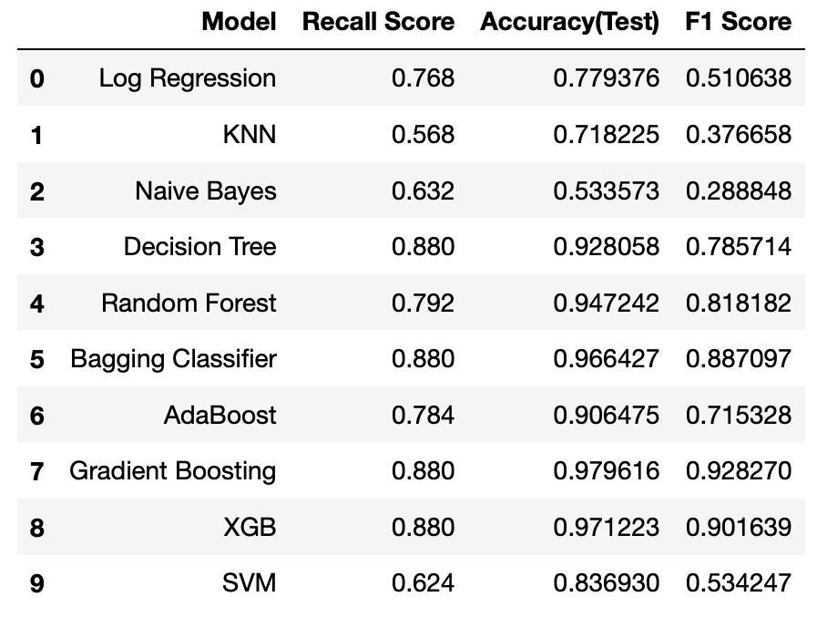

# Telecom Company Customer Churn Prediction

### Business Case

A telecom company is looking for an effective way to predict customer churn to inform their client retention strategies. Using a dataset containing information about over 3,000 current and past customers, I'm going to select a classification algorithm that should accurately predict if a customer is about to churn and also list what data can serve as reliable predictors for potentially losing that customer.

Some of the questions that guided my exploration and analysis:

* Does the state the customer lives in matter when it comes to churn prediction?
* Does it matter how often they callt the Customer Support line?
* Does it matter if they have an international plan enabled on their plan?

### The Data

[Link to dataset on Kaggle](https://www.kaggle.com/becksddf/churn-in-telecoms-dataset)

Our cliend supplied a data set containing information on about 3,300+ of their customers. Here's a detailed description of the features:

* **state:** the state the user lives in
* **account length:**  the number of days the user has this account
* **area code:**  the code of the area the user lives in
* **phone number:**  the phone number of the user
* **international plan:** true if the user has the international plan, otherwise false
* **voice mail plan:** true if the user has the voice mail plan, otherwise false
* **number vmail messages:** the number of voice mail messages the user has sent
* **total day minutes:** total number of minutes the user has been in calls during the day
* **total day calls:** total number of calls the user has done during the day
* **total day charge:** total amount of money the user was charged by the Telecom company for calls during the day
* **total eve minutes:** total number of minutes the user has been in calls during the evening
* **total eve calls:** total number of calls the user has done during the evening
* **total eve charge:** total amount of money the user was charged by the Telecom company for calls during the evening
* **total night minutes:** total number of minutes the user has been in calls during the night
* **total night calls:** total number of calls the user has done during the night
* **total night charge:** total amount of money the user was charged by the Telecom company for calls during the night
* **total intl minutes:** total number of minutes the user has been in international calls
* **total intl calls:** total number of international calls the user has done
* **total intl charge:** total amount of money the user was charged by the Telecom company for international calls
* **customer service calls:** number of customer service calls the user has done
* **churn:** true if the user terminated the contract, otherwise false

### Data Cleanup and EDA

This dataset was incredibly clean: no missing values, no duplicates, no crazy outliers. 

The only issue I had to address was the significant class imbalance. I used SMOTE to fix that:

Over 14% of the customers are in the churn category. 

In the EDA notebook, I look at the relationship of individual features and decide which ones to keep and drop.

### Vanilla Models

I fit 10 different vanilla models to explore which ones are worth fine-tuning.

**Metric to use: Recall**
Given the business problem at hand, I believe the best metric to use is Recall. It is better to categorize a loyal customer as someone likely to churn instead of misclassifying a departing customer as loyal, in which case we won't enroll them in our retention program. Financially, that could be the difference between offering someone a discount that wasn't really needed (in a False Positive scenario) vs. having to acquire an entirely new client to make up for False Negative.

### THE FINAL MODEL 

I used GridSearch to fine-tune two models using Bagged Trees and Gradient Boosting. The final model ended up being a Gradient Boosting model with a Recall Score of 93.28% and an Accuracy Score of 96.24%

The most important predictors are:

* Customer Service Calls
* Total Charge
* International Plan
* Voice Mail Plan
* Total International Calls
 
 ### BUSINESS RECOMMENDATIONS:
 
* If the telecom companies notices a client is calling the Customer Support line more than 4 times, it's a good idea to implement a retention plan. Perhaps by offering a discount. 

* Customers who pay more than $40 are at a higher risk of canceling their contract. If a customer is paying more than that and calling your Customer Support line, that's a red flag you don't want to ignore.

 
 
### FUTURE WORK:

* Exploring if area coverage has an impact on customer churn
* Exploring if the state/city the customer lives in is a dominatede by another competitor 
* Look into text message and Data utilization

 

